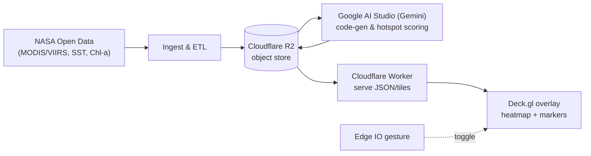

# FINDS — Sharks From Space 🦈🌍
by Yasmine 3k & Gunncho 3k

**Fin Identification & Navigation from Satellite**  
**NASA Space Apps NYC | NYU (Edmund Gunn Jr, Yasmine Dweir)**

[](LICENSE)


FINDS identifies likely shark-activity hotspots by combining open NASA satellite data with AI-assisted feature scoring, stores results in **Cloudflare R2** (zero-egress), and renders interactive 3D visualizations with **Deck.gl**. A live **Edge IO** gesture toggles viz modes during the demo.

---

## Architecture

> GitHub's Mermaid requires HTML `<br/>` for line breaks and quoted labels. (Docs: "Creating diagrams".)



## Features

- 🦈 **Shark Species Gallery**: Interactive gallery with shark images and information
- 🎮 **Edge IO Gesture Controls**: Keyboard, mobile motion, and touch gestures
- 🌊 **AI-Powered Hotspot Generation**: Uses Google Gemini API for realistic predictions
- 📱 **PWA Support**: Installable on mobile devices with offline capabilities
- 🗺️ **Interactive 3D Map**: Powered by Deck.gl for smooth visualization
- ⚡ **Cloudflare Worker Backend**: Fast, edge-optimized API with R2 caching

## Quick Start

### Local Development (with Worker)

1. **Install dependencies:**
   ```bash
   npm install
   ```

2. **Set up Cloudflare Worker (optional):**
   ```bash
   # Create .dev.vars in api/worker/
   echo "GEMINI_API_KEY=your_api_key_here" > api/worker/.dev.vars
   
   # Start local worker
   npm run worker:dev
   ```

3. **Start web app:**
   ```bash
   # Mac/Linux
   VITE_API_BASE="http://127.0.0.1:8787" npm run dev
   
   # Windows
   set VITE_API_BASE=http://127.0.0.1:8787 && npm run dev
   ```

### Local Development (without Worker)

```bash
npm install
npm run dev
```

The app will automatically fall back to demo data if no API is available.

## Edge IO Gesture Controls

### Desktop (Keyboard)
- **Arrow Keys**: Navigate regions and adjust hotspot count
  - `←` / `→`: Decrease/increase hotspot count by 50
  - `↑` / `↓`: Cycle through preset regions
- **+/-**: Fine-tune hotspot count by 100
- **Space**: Toggle shark gallery

### Mobile (Motion + Touch)
- **Shake**: Toggle shark gallery
- **Tap**: Floating tap button for gesture input
- **Pinch/Spread**: Adjust hotspot density

### Preset Regions
- New York Bight
- California Coast
- Florida Keys
- Great Barrier Reef
- Hawaiian Islands
- Mediterranean Sea

## Deployment

### Cloudflare Worker + Pages

1. **Deploy Worker:**
   ```bash
   cd api/worker
   wrangler deploy
   ```

2. **Build and Deploy Web App:**
   ```bash
   VITE_API_BASE="https://your-worker.workers.dev" npm run build
   wrangler pages deploy dist --project-name=finds-web
   ```

### GitHub Actions (Automatic)

The repository includes a CI/CD pipeline that automatically:
- Deploys the Cloudflare Worker
- Builds the web app with the correct API endpoint
- Deploys to Cloudflare Pages

## Offline Fallback

The app gracefully handles offline scenarios:
1. **Primary**: Cloudflare Worker API
2. **Fallback**: Local demo data (`/public/demo.json`)
3. **Final**: Mock data generation

## PWA Installation

### Mobile (iOS/Android)
1. Open the app in your mobile browser
2. Look for "Add to Home Screen" option
3. Install as a native app

### Desktop
- Chrome/Edge: Look for install button in address bar
- Firefox: Add to Home Screen option in menu

## Development Scripts

```bash
# Development
npm run dev                    # Start dev server
npm run start:mac             # Mac-optimized dev server
npm run start:win             # Windows dev server (port 3000)

# Worker development
npm run worker:dev             # Local Cloudflare Worker

# Production
npm run build                  # Build for production
npm run preview               # Preview production build
```

## Project Structure

```
├── components/           # React components
│   ├── SharkGallery.tsx # Shark species gallery
│   ├── Controls.tsx     # Main control panel
│   └── ...
├── services/
│   ├── geminiService.ts # AI API integration
│   └── edgeio.ts        # Gesture control system
├── api/worker/          # Cloudflare Worker
│   ├── src/worker.mjs  # Worker implementation
│   └── wrangler.jsonc  # Worker configuration
├── public/
│   ├── sharks/         # Shark images
│   ├── demo.json       # Fallback data
│   ├── manifest.json   # PWA manifest
│   └── sw.js           # Service worker
└── .github/workflows/  # CI/CD pipelines
```

## Environment Variables

### Development
- `GEMINI_API_KEY`: Google Gemini API key (for direct API calls)
- `VITE_API_BASE`: Cloudflare Worker URL (for production)

### Production
- `CLOUDFLARE_API_TOKEN`: For CI/CD deployment
- `CLOUDFLARE_ACCOUNT_ID`: For CI/CD deployment

## Troubleshooting

### Images Not Loading
- Ensure shark images are in `/public/sharks/`
- Check `metadata.json` has correct file references
- Verify image file extensions match metadata

### Gestures Not Working
- Check browser permissions for motion sensors
- Ensure Edge IO service is active (green indicator)
- Try keyboard fallback on desktop

### API Errors
- Verify `VITE_API_BASE` is set correctly
- Check Cloudflare Worker logs
- App will fallback to demo data automatically

## 📊 **Project Presentation**

### **Slide Deck**
Our comprehensive presentation showcasing the FINDS project:

- **📋 [Project Slides](https://drive.google.com/file/d/111xzfdWaFjN1wSuBbt7DkpPj1DUrm_k4/view?usp=drive_link)** - Complete project overview and technical details
- **🎯 Key Features**: Shark hotspot detection, AI-powered analysis, 3D visualization
- **🔬 Technical Stack**: NASA satellite data, Gemini AI, Cloudflare R2, Deck.gl
- **🌊 Demo**: Live Edge IO gesture controls for interactive visualization

### **Presentation Highlights**
- **Problem Statement**: Shark conservation and marine ecosystem monitoring
- **Solution**: AI-powered satellite data analysis for shark hotspot identification
- **Technology**: Advanced machine learning with NASA satellite imagery
- **Impact**: Supporting marine conservation and research efforts

### **Demo Features**
- **Interactive 3D Visualization**: Real-time shark hotspot mapping
- **Gesture Controls**: Edge IO integration for hands-free navigation
- **AI Analysis**: Gemini-powered hotspot prediction and scoring
- **Data Sources**: NASA satellite imagery and oceanographic data

## Contributing

1. Fork the repository
2. Create a feature branch
3. Make your changes
4. Test thoroughly (especially gestures and PWA)
5. Submit a pull request

## License

MIT License - see LICENSE file for details.
