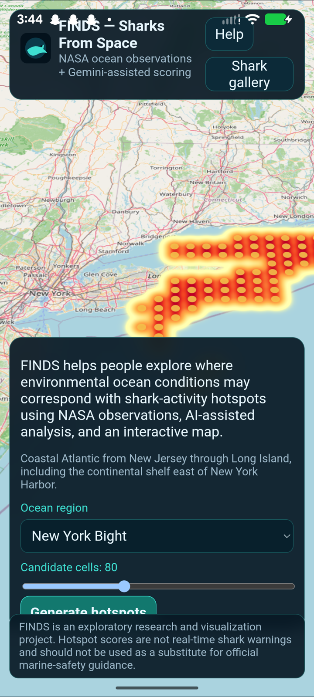
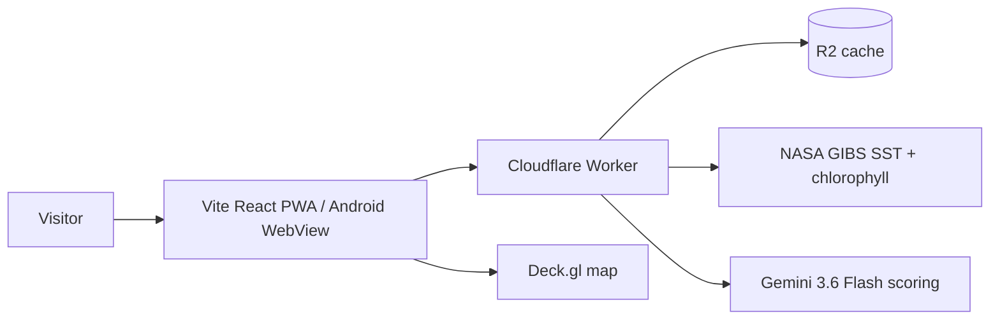

# FINDS — Sharks From Space

FINDS helps people explore where environmental ocean conditions may correspond with shark-activity hotspots using NASA observations, Gemini-assisted analysis, and an interactive map.

🏆 **NYC Best Use of Gemini API — NASA Space Apps Challenge 2025**  
NASA Space Apps NYC | collaborators **Edmund Gunn Jr.** and **Yasmine Dweir**

> FINDS is an exploratory research and visualization project. Hotspot scores are not real-time shark warnings and should not be used as a substitute for official marine-safety guidance.

**Try FINDS:** production URL is set after Cloudflare Pages deploy (`FINDS_PAGES_URL` repository variable).  
**API:** production Worker URL (`FINDS_WORKER_URL` repository variable) serves `/health`, `/version`, and `POST /api/hotspots`.

[How FINDS works](docs/ARCHITECTURE.md) · [Install Android](docs/GETTING_STARTED.md#android) · [NASA provenance](docs/data/NASA_DATA_PIPELINE.md) · [Scientific limitations](docs/data/SCIENTIFIC_LIMITATIONS.md) · [Pixel 6a evidence](docs/release/PIXEL_6A_VALIDATION.md) · [Claims vs evidence](docs/release/CLAIMS_EVIDENCE_MATRIX.md)


[](LICENSE)

## Explain it like I'm new

- **What is a shark hotspot here?** A scored ocean cell where NASA sea-surface temperature and chlorophyll-a look more like conditions researchers associate with marine productivity and thermal habitat. It is not a confirmed shark and not a beach flag.
- **What does NASA provide?** Public GIBS visualizations of JPL MUR Level-4 SST and PACE/VIIRS chlorophyll-a. FINDS samples those rasters on a geographic grid and records provenance.
- **What does Gemini do?** Production uses **Gemini 3.6 Flash** ([model docs](https://ai.google.dev/gemini-api/docs/models/gemini-3.6-flash)) to rank and explain NASA-derived cells only. It does not invent coordinates.
- **What does the map show?** A heatmap and markers for scored cells. Gold markers are the highest exploratory scores, also labeled in text.
- **Is this a real safety warning?** No.

## Recruiter snapshot

FINDS began as a NASA Space Apps 2025 hackathon prototype that won **NYC Best Use of Gemini API**. This release adds a NASA observation pipeline, a Cloudflare Worker with R2 cache, Gemini 3.6 Flash structured scoring, tests, UML, PWA packaging, and a Capacitor Android app validated on Pixel 6a.

**Team:** Edmund Gunn Jr. and Yasmine Dweir. Public commit history is the verifiable contribution record.

**Skills demonstrated:** React, TypeScript, Vite, Deck.gl, NASA GIBS, Gemini structured output, Cloudflare Workers/R2/Pages, PWA, Capacitor Android, Vitest/Playwright, accessibility, scientific provenance.

**Supported platforms:** Web PWA, Capacitor Android APK (`com.gunnchos.finds`).

Architecture in 60 seconds: the UI posts a region to the Worker; the Worker checks R2; on miss it pulls NASA GIBS SST + chlorophyll, converts pixels through official colormaps, scores cells, asks Gemini 3.6 Flash to explain those cells, caches the JSON, and returns provenance to Deck.gl.

## Engineer

```bash
git clone https://github.com/gunnchOS3k/FINDS-Sharks-From-Space.git
cd FINDS-Sharks-From-Space
npm ci
npm run dev
```

Demo/offline mode works without secrets. Live NASA + Gemini scoring:

```bash
cp .env.example .env
cd api/worker && cp ../../.env.example .dev.vars
# put GEMINI_API_KEY in api/worker/.dev.vars — never commit it
npm run worker:dev
VITE_API_BASE=http://127.0.0.1:8787 npm run dev
```

Primary local gate: `npm run verify`  
Production smoke (after deploy): `FINDS_WORKER_URL=… FINDS_PAGES_URL=… npm run test:production`

| Path | Role |
|---|---|
| `src/` | Canonical Vite + React UI |
| `shared/` | NASA ingest, scoring, Gemini, validation |
| `api/worker/` | Cloudflare Worker |
| `docs/architecture/uml/` | PlantUML + SVG (8 diagrams) |
| `android/` | Capacitor wrapper |

See [Getting started](docs/GETTING_STARTED.md), [Architecture](docs/ARCHITECTURE.md), [NASA pipeline](docs/data/NASA_DATA_PIPELINE.md), [Provenance](docs/data/DATA_PROVENANCE.md), [Limitations](docs/data/SCIENTIFIC_LIMITATIONS.md).

### Pixel 6a (production APK)

Build against the live Worker (not localhost):

```bash
FINDS_WORKER_URL=https://<your-worker>.workers.dev npm run android:build
npm run android:install
```




```mermaid
flowchart LR
  U[Visitor] --> UI[Vite React PWA / Android WebView]
  UI --> W[Cloudflare Worker]
  W --> R2[(R2 cache)]
  W --> NASA[NASA GIBS SST + chlorophyll]
  W --> G[Gemini 3.6 Flash scoring]
  UI --> MAP[Deck.gl map]
```

[Component diagram](docs/architecture/uml/02-component.svg) · [Generate sequence](docs/architecture/uml/04-sequence.svg) · [ADR-001](docs/architecture/ADR-001-canonical-client.md)
