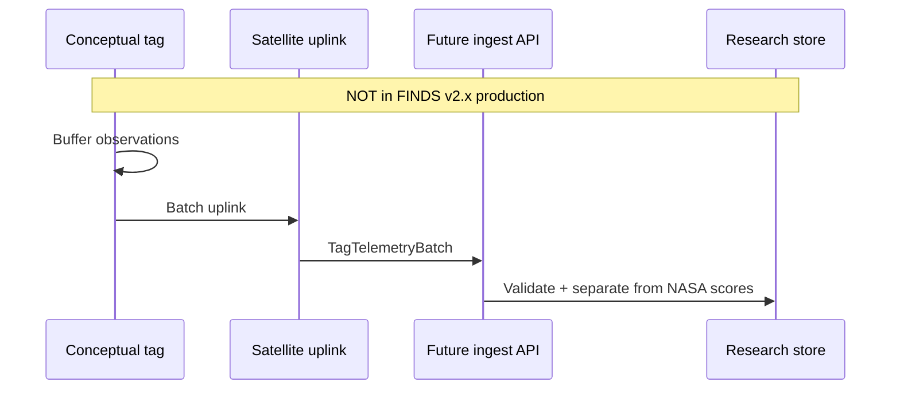

# CONCEPTUAL DESIGN — NOT PHYSICALLY DEPLOYED OR ANIMAL-TESTED

This document satisfies the NASA Space Apps **Sharks from Space** prompt to *suggest a new conceptual model of a tag* that could measure where sharks are, what they may be eating, and transmit data for predictive models. **FINDS v2.x does not build, deploy, or test such a tag.** No live tag telemetry is ingested in production. Synthetic examples exist only as typed fixtures (`shared/tagConcept.ts`) and are labeled **SYNTHETIC**.

## Challenge alignment

| Challenge ask | FINDS response |
|---|---|
| Conceptual tag model | This document + `shared/tagConcept.ts` |
| Real-time transmission to users | **Conceptual only** — production FINDS uses delayed NASA GIBS rasters, not tag uplinks |
| Diet / foraging measurement | Conceptual proxies (accelerometry, eDNA stub, isotope slot) — not implemented |
| Predictive models from tag data | **Future research** — not connected to v2.0.0 scoring pipeline |

## Design goals

1. **Animal welfare** — minimally invasive attachment; duty-cycled sensors; no continuous high-power uplink.
2. **Privacy** — coarse public heatmaps; raw tracks restricted to researchers with consent.
3. **Scientific coupling** — tag batches are a separate stream from NASA SST/chlorophyll scoring; fusion would require validated models, not v2.x heuristics.
4. **Honest labeling** — all demo tag JSON carries `provenance: SYNTHETIC` and `synthetic: true`.

## Conceptual tag hardware (not built)

| Subsystem | Purpose | Notes |
|---|---|---|
| GPS / ARGOS / Iridium burst | Position fixes when at surface | Duty-cycled; no “real-time shark map” claim |
| Depth / temperature | Vertical behavior vs SST context | Helps interpret surface-only satellite overlap |
| IMU / accelerometer | Foraging-bout proxy | Not validated as diet sensor |
| Optional eDNA / isotope sample holder | Future lab analysis slot | Ex-situ; not real-time diet ID |
| Edge buffer + batch uplink | Low-bandwidth transmission | Matches `TagTelemetryBatch` in code |

## Data model (TypeScript)

See `shared/tagConcept.ts`:

- `SharkIdentity` — registry id + species label
- `TagIdentity` — tag id, firmware, attachment metadata
- `TagObservation` — lat/lon, depth, foraging proxy, **`synthetic: true`**
- `TagTelemetryBatch` — uplink batch with **`provenance: 'SYNTHETIC' | 'FIXTURE'`**
- `TagTransmissionState` — conceptual link state (not implemented)

## Transmission flow (conceptual)

Production FINDS today: **UI → Worker → NASA GIBS → heuristic score → optional Gemini explain → map**. Tag batches do not enter that path.

## Relationship to NASA satellite scoring

NASA MUR SST and PACE/VIIRS chlorophyll in FINDS are **environmental** inputs. A future validated fusion model might compare tag tracks to SST fronts and chlorophyll fields; v2.x explicitly does **not** treat tag fixtures as evidence of shark presence in live hotspots.

## Safety and ethics

- Not a marine-safety or lifeguard product.
- No encouragement to approach tagged or untagged sharks.
- Institutional IRB / tagging permits would be required before any real deployment — out of scope for this hackathon codebase.

## Version history

| When | What |
|---|---|
| Oct 2025 hackathon | Verbal/conceptual tag idea in team pitch |
| v2.0.0 (Aug 2026) | NASA + Gemini production pipeline; tag model documented here, not deployed |
| This alignment pass | Typed conceptual model + explicit SYNTHETIC fixtures |
